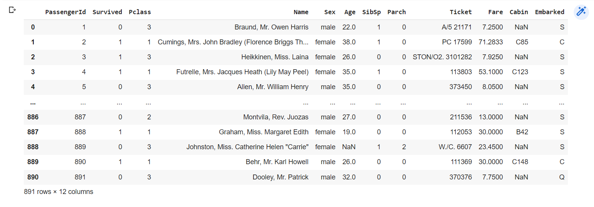

# EX-05-Feature-Generation


## AIM
To read the given data and perform Feature Generation process and save the data to a file. 

# Explanation
Feature Generation (also known as feature construction, feature extraction or feature engineering) is the process of transforming features into new features that better relate to the target.
 

# ALGORITHM
### STEP 1
Read the given Data
### STEP 2
Clean the Data Set using Data Cleaning Process
### STEP 3
Apply Feature Generation techniques to all the feature of the data set
### STEP 4
Save the data to the file
# CODE
## titanic
``` python
import pandas as pd
import seaborn as sns
import numpy as np
import matplotlib.pyplot as plt
import sklearn.preprocessing as s
df=pd.read_csv("/content/titanic_dataset.csv")
df
df2=df.copy()
df2
gender=['male','female']
bas=s.OrdinalEncoder(categories=[gender])
bas.fit_transform(df2[["Sex"]])
df2['change_Change']=bas.fit_transform(df2[["Sex"]])
df2
df2["changelable_2"]=s.LabelEncoder().fit_transform(df2["Cabin"])
df2
!pip install category_encoders
from category_encoders import BinaryEncoder
new = BinaryEncoder().fit_transform(df2['Sex'])
df3=df.copy()
df3=pd.concat([df3,new],axis=1)
df3
df4=df.copy()
pd.get_dummies(df4,columns=["Sex"])
```

# OUTPUT



## RESULT
the program run sucessfully